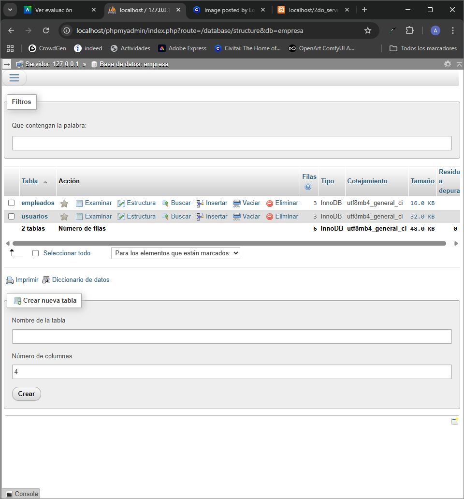
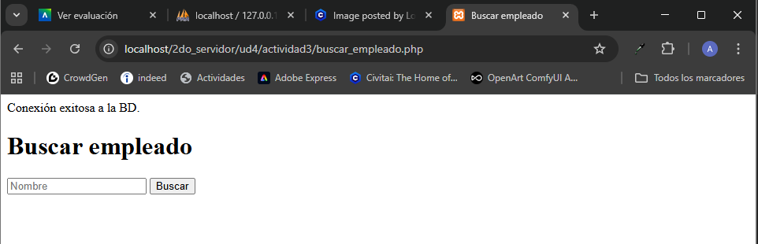
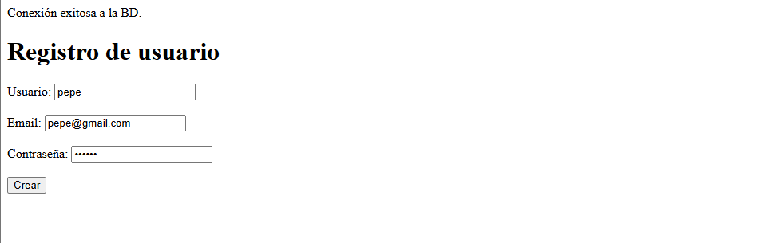
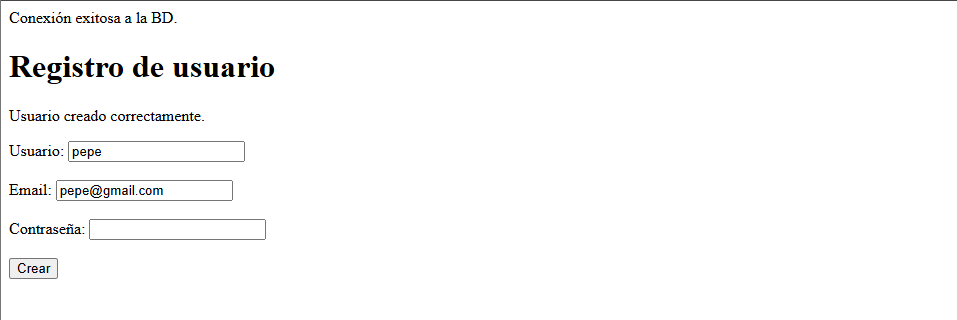
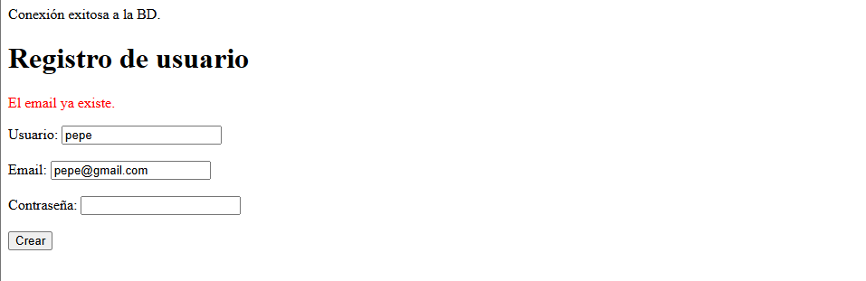
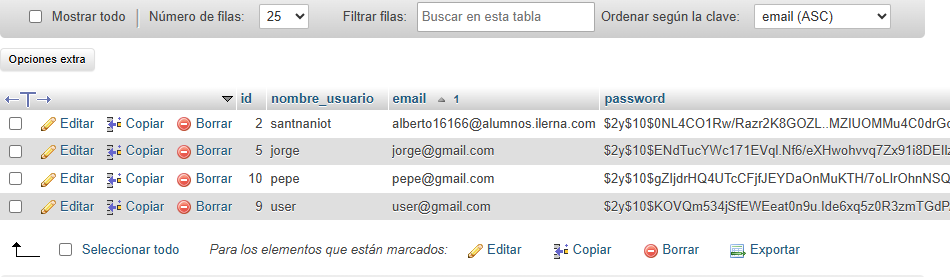

## creacion de la base de datos
Al inicializar MySQL y Apache en XAMPP fui a `localhost/phpmyadmin` para ver las bases de datos y desde ahí creé la base de datos `empresa`. Posteriormente con los scripts dado creé las tablas. 


## /actividad1

### 1. config.php
- Define los parámetros de conexión a la base de datos como constantes:
  - `DB_HOST` → dirección del servidor MySQL.
  - `DB_NAME` → nombre de la base de datos.
  - `DB_USER` → usuario de la base de datos.
  - `DB_PASS` → contraseña del usuario.
  - `DB_CHARSET` → codificación de caracteres.
- Construye la variable `$dsn` (Data Source Name) que PDO utiliza para conectarse a MySQL.

## 2. conexion.php
- Incluye `config.php` para usar los datos de conexión.
- Crea un objeto PDO (`$pdo`) usando el DSN, usuario y contraseña.
- Configura PDO con:
  - `PDO::ATTR_ERRMODE => PDO::ERRMODE_EXCEPTION` → para lanzar excepciones ante errores.
  - `PDO::ATTR_DEFAULT_FETCH_MODE => PDO::FETCH_ASSOC` → para obtener resultados como arrays asociativos.
- Usa `try/catch` para capturar errores de conexión y mostrarlos de manera segura.

## /actividad2

### listar_empleados.php
utilizo la conexión creada en conexion.php y la importo una vez con:
````php
require_once __DIR__ . '/../actividad1/conexion.php';
````
luego genero el statement y guardo en la variable empleados la ejecución de ese statement (select) utilizando fetchAll() y así luego poder recorrer los datos con un forEach y mostrar los datos en el html.


Si no hay registros, se muestra un mensaje indicando que no existen empleados.  

## /actividad3

### buscar_empleado.php

Incluye un formulario que mantiene el valor ingresado tras el envío usando `value="<?=htmlspecialchars($input_nombre)?>"`.  
Muestra resultados solo después de que se haya enviado el formulario, controlando la visualización con `$_SERVER['REQUEST_METHOD']==='POST'`.  
El `try/catch` captura errores específicos de la consulta, evitando que el script se rompa y mostrando un mensaje seguro.


## /actividad4

### nuevo_usuario.php
Volvemos a importar conexion.php. 
Creamos un array en el que almacenar los diferentes errrores que podamos encontrarnos, como no introducir el nombre de usuario o poner una contraseña demasiado corta.
En caso de no existir errores, comprobamos que el email no esté duplicado para evitar registros innecesarios. El que se registra pasará en un futuro a tener que loguearse. 

Para evitar inyecciones en el código preparamos el statement con `bindValue()` y además hasheamos la contraseña para no poder verla en la tabla de la base de datos y no hacer un uso fraudulento de los datos del usuario.






Observamos que, efectivamente, Pepe se ha registrado con datos correctos y la contraseña se se encuentra oculta para nosotros.



## /actividad5

### lista.php
Este archivo se encarga de listar todos los empleados en la tabla empleados mostrándolos en una tabla como ya hicimos en la actividad2. 
### eempleado.php

### eliminar_empleado.php

## /actividad6

### index.php
### usuario.php
### register.php
### login.php
### logout.php
### usuarios_lista.php
### editar_usuario.php
### eliminar_usuario.php
